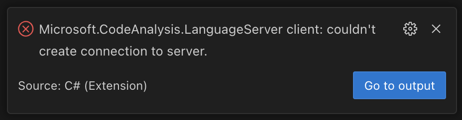

# nix-flake-example-dotnet

An example dotnet project using a nix flake for specifying it's development environment.

## Getting Started

### Dependencies

1. Install [Nix](https://nixos.org)
2. Install [direnv](https://direnv.net) & [nix-direnv](https://github.com/nix-community/nix-direnv)
3. Install [VSCode](https://code.visualstudio.com)
4. Install the [recommended VSCode extensions](./.vscode/extensions.json)

TODO: Quickstart option to install these via Nix.

### Workflow

1. Clone the repository

   `git clone https://github.com/squirmy/nix-flake-example-dotnet`

2. Change directory

   `cd nix-flake-example-dotnet`

   If the dependencies are installed correctly you should see an error:

   `` direnv: error /Users/squirmy/code/nix-flake-example-dotnet/.envrc is blocked. Run `direnv allow` to approve its content ``

3. Allow direnv to install the dependencies in the nix flake

   `direnv allow`

4. Run a build to test it out

   `dotnet build`

5. Launch VSCode from this directory for the best experience See [Known Issues](#1-vscode-microsoftcodeanalysislanguageserver-error-on-startup).

   `code .`

## Known Issues

### 1. VSCode: Microsoft.CodeAnalysis.LanguageServer error on startup



VSCode extensions do not have an order in which they are loaded on startup. Sometimes the dotnet extension will try to load before the [direnv extension](https://marketplace.visualstudio.com/items?itemName=mkhl.direnv) has had a chance to set the `DOTNET_BIN` environment variable causing this error.

This error can be safely ignored as the direnv extension is configured to restart extensions after the environment changes.

```json
"direnv.restart.automatic": true
```

Changing directory into this project and then launching VSCode from the command line will avoid this error completely as VSCode will inherit the environment from the shell.
